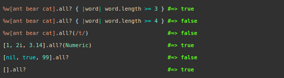

# enumerables

This is the second project of the Main Ruby curriculum at [Microverse](https:www.microverse.org/) - @microverseinc.
All public class methods tested with RSpec.

# enumerables ([The Odin Project](https://github.com/TheOdinProject/curriculum/blob/master/ruby_programming/archive/basic_ruby/project_advanced_building_blocks.md#project-2-enumerable-methods))



## Built With

- Ruby

## Description

The task was to implement some enumerable methods similar to the ones that exist in the Enumerables module in ruby.

This project is mainly about

-  Learning ruby syntax
-  Enumerables

## Development

* Run script
```
ruby enumerables.rb
```
* Run ```rspec``` or ```rspec --format doc``` in the terminal of your root directory to run the described tests
## Live Demo

[](https://repl.it/github/Bluette1/enumerables)

## Authors

👤 **Marylene Sawyer**
- Github: [@Bluette1](https://github.com/Bluette1)
- Twitter: [@MaryleneSawyer](https://twitter.com/MaryleneSawyer)
- Linkedin: [Marylene Sawyer](https://www.linkedin.com/in/marylene-sawyer-b4ba1295/)

## 📝 License

This project is [MIT](https://opensource.org/licenses/MIT) licensed.
